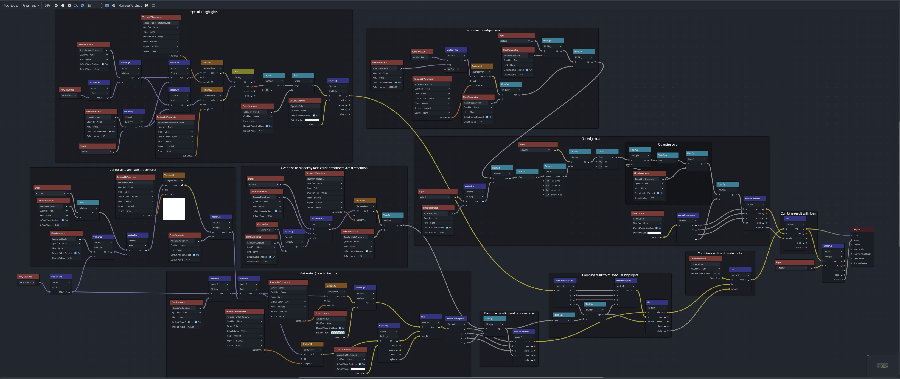

# 2d-pixel-water-shader-godot

A Godot mono 4.4 project containing the pixel art water and water trail shaders as seen on YouTube [here](https://www.youtube.com/watch?v=pGOLstWBCDA&t=613s) and [here](https://www.youtube.com/watch?v=W4eVR_Fm5Gs)! 

The shaders are Visual Shaders and there are a few simple C# scripts for the water trails. Does not include heightmap generation.

### Water shader:
https://github.com/jess-hammer/2d-pixel-water-shader-godot/assets/59108399/fde19bf9-975b-4b8c-bfb8-dfe4d9b7009c

Unlike in my video, this shader now uses the inbuilt Godot noise textures generated by FastNoiseLite. Because the noise comes from a texture and isn't generated at runtime, this should provide some performance improvements (however it may introduce repetition - if that happens feel free to make the textures larger).

### Water trail following the cursor:
https://github.com/jess-hammer/2d-pixel-water-shader-godot/assets/59108399/cdc18748-a94f-4735-9c30-6489e68771fc

There is also a Unity version of the water shader [here](https://github.com/jess-hammer/2d-pixel-water-shader)